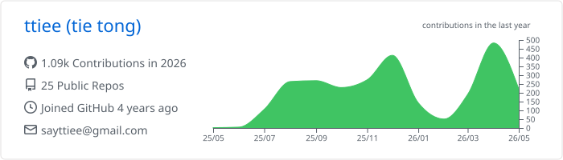
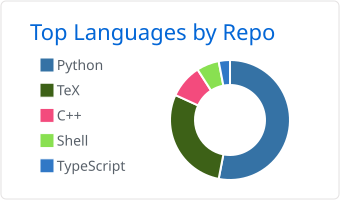
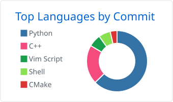
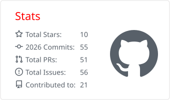
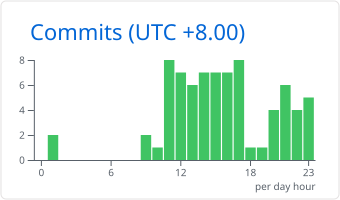

<!-- markdownlint-disable MD013 MD033 MD041 -->

# Hi, I'm Tie Tong / 仝铁

Mechanical Engineering undergraduate at Soochow University, building toward mobile robot navigation, embodied intelligence, and AI-assisted developer workflows.

## About

- I work on **robot navigation, multimodal perception, deep reinforcement learning, and embodied intelligence systems**.
- My current research interests include proactive navigation in dynamic environments, social robot navigation, and multi-agent coordination.
- I like projects that close the loop from **modeling and simulation** to **ROS integration, real robot debugging, and experimental analysis**.
- Outside research code, I build small tools around developer automation, personal workflows, Linux desktop configuration, and technical writing.

## Current Focus

| Direction | What I am doing |
| --- | --- |
| Proactive robot navigation | Temporal traversability prediction, risk-aware A*, dynamic-door navigation, and topology-aware planning experiments. |
| Social navigation | Interaction-aware SVO modeling, crowd navigation with deep reinforcement learning, and lightweight reproducible simulation environments. |
| Robot systems | ROS-based delivery robot platform with SLAM, AMCL, DWA/TEB planning, QR/OCR perception, and manipulator control. |
| Agent tooling | Bringing local coding agents into chat and remote workflows through NoneBot, Telegram, and Codex CLI integrations. |

## Tech Stack

### Robotics and Simulation

### Machine Learning and Algorithms

### Engineering

## Research and Awards

- Patent work around robot path planning, risk-aware navigation, and mobile robot systems, including first-inventor authorization for a robot path-planning method.
- Student technology association work, technical writing, and long-term robotics competition practice.

## GitHub Activity

<picture>
  <source media="(prefers-color-scheme: dark)" srcset="https://raw.githubusercontent.com/ttiee/ttiee/grid-snake/github-contribution-grid-snake-dark.svg">
  <source media="(prefers-color-scheme: light)" srcset="https://raw.githubusercontent.com/ttiee/ttiee/grid-snake/github-contribution-grid-snake.svg">
  
</picture>

## Contact

- Blog: [saytt.cc](https://saytt.cc)
- Email: [sayttiee@gmail.com](mailto:sayttiee@gmail.com)
